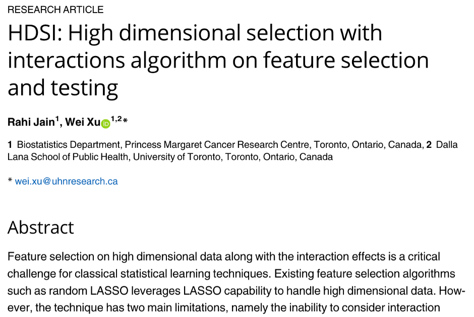
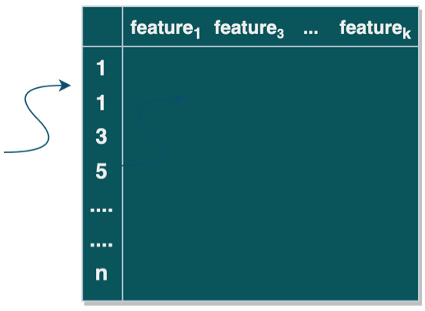
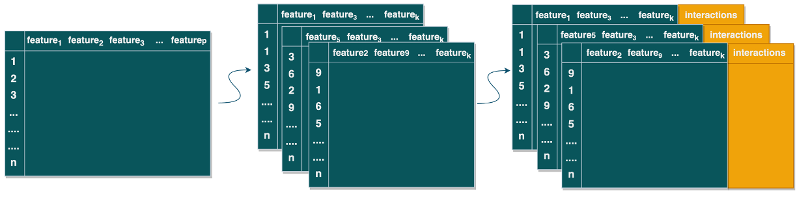
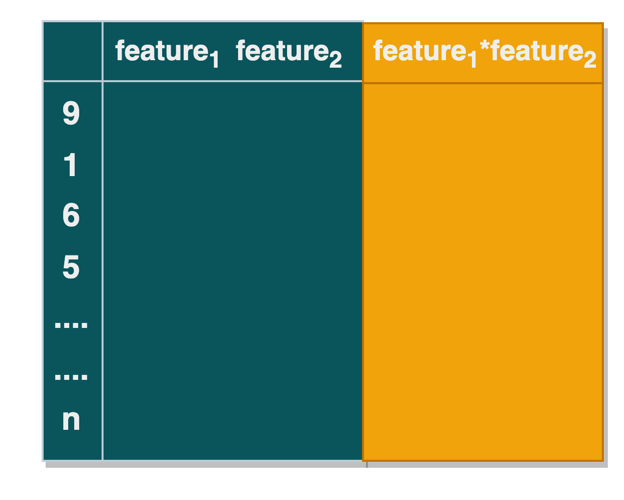
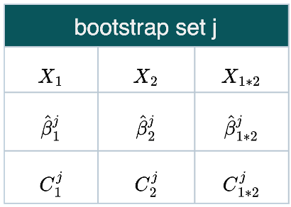

```{r setup, include=FALSE}
options(htmltools.dir.version = FALSE)
knitr::opts_chunk$set(
  fig.width=9, fig.height=3.5, fig.retina=3,
  out.width = "100%",
  cache = FALSE,
  echo = TRUE,
  message = FALSE, 
  warning = FALSE,
  hiline = TRUE
)
```

```{r xaringan-themer, include=FALSE, warning=FALSE}
library(xaringanthemer)
style_duo_accent(
  primary_color = "#1381B0",
  secondary_color = "#FF961C",
  inverse_header_color = "#FFFFFF",
  header_font_google = google_font("DM Serif Display"),
  text_font_google = google_font("DM Serif Display"),
  header_h1_font_size = "2.5rem",
  header_h2_font_size = "2rem",
  header_h3_font_size = "1.25rem",
  text_font_size = "1rem"
)
```

# Background
.pull-left[
[Princess Margaret Cancer Center](https://www.uhnresearch.ca/institutes/pm)
- Focuses on: cancer reserach including genomics, informatics, etc. 

- High dimensional
- time-to-event
]

.pull-right[

]
Problems with modelling using high dimensional data
- model overfitting, generalizability;

- unstable estimates

- time/cost

  <span style="margin-left: 12%;color:#1381B0;font-size:1.5rem"> Feature Selection algorithm for time-to-event data is necessary</span>
---
# Background

### What is feature selection?   

--
> A process to select **a subset of features**  that are **useful** for model building

--

### Feature selection is especially useful when:
> Have data set with high dimensional feature space:  

> Number of features are relatively large compares to number of samples/"events" (e.g, genotyping data)

--

### Commonly used techniques:
> expert-based; statistics-based(for example, lasso,ridge)

---
<span style="color:black;font-weight:90;font-size:1.25rem"> 
However, **interactive effects are usually not considered** in the existing methods
</span>

--

<span style="color:black;font-weight:90;font-size:1.25rem"> 
**HDSI algorithm**: 1. interaction terms; 2. statistical significance of features

<div style="float: left; width: 33%; text-align: center;">
 
</div>

<div style="float: left; width: 33%; text-align: center;">
 
</div>

<div style="float: left; width: 33%; text-align: center;">
 
</div>
---
class: center, middle 

<span style="color:black;font-weight:90;font-size:1.8rem"> 
Question:   Is HDSI/RHDSI Robust? Can it be extend to different types of data? </span>

--

<br>

<span style="color:black;font-weight:90;font-size:1.8rem"> 
Objective: 
Develop feature selection algorithm with **interactions** for **time-to-event data**
</span>

---
# Method Pipeline
> ### Step 1: Develop algorithms for model building and hyper parameters tuning

<br>
> ### Step 2: Conduct simulations with high dimensional features with both marginal and interactive effects

<br>

> ### Step 3: Evaluate the model performance on simulated data and compare the developed method with existing methods


<br>
> ### Step 4: Implement the algorithm into real clinical study


---
# Step:

<div style="float: left; width: 30%; text-align: center;">


<br>
<br>
Original dataset   
<br>
<br>
dimension:(n,p)


</div>

--

<div style="float: left; width: 30%; text-align: center;">


<br>
<br>
&nbsp &nbsp &nbsp &nbsp &nbsp &nbsp bootstrap set 
<br>
<br>
&nbsp &nbsp &nbsp &nbsp &nbsp &nbsp  without interactions

<br>
<br>
&nbsp &nbsp &nbsp &nbsp &nbsp &nbsp  dimension:(n,k)

</div>

--

<div style="float: left; width: 40%; text-align: center;">


<br>
<br>
&nbsp &nbsp &nbsp &nbsp &nbsp &nbsp bootstrap set 
<br>
<br>
&nbsp &nbsp &nbsp &nbsp &nbsp &nbsp  with interactions

<br>
<br>
&nbsp &nbsp &nbsp &nbsp &nbsp &nbsp  dimension:(n,k+choose(k,2)) 

</div>

---
## Step 2: Generate Bootstrap Sets

> **Step 2b):** Generate **B** Bootstrap sets, i.e.,repeat Step 2a) B times

<br>


---
## Step 3: Build Model & Select Features 

> **Step 3a):** For the $j^{th}$ bootstrap set, apply feature selection algorithms (e.g., lasso/ridge) to fit a model:

.pull-left[
- for illustration purpose,
consider two features

- n observations]               

--

.pull-right[
$X_i: i^{th} \text{feature, } i \in \{ \text{1,2,3,...p,p+1,...}{p\choose 2}\}$

$\hat{\beta_i^j} \text{ :estimate of } X_i \text{ in the } j^{th} \text{ bootstrap set, } j \in \{ \text{1,2,3,...k}\}$

$C_i^j \text{ :C index of } X_i \text{ in the } j^{th} \text{ bootstrap set, }j \in \{ \text{1,2,3,...k}\}$
]


---

> **Step 3b):** Repeat 3a) for all boostrap sets:


--

> **Step 3c):** Pool results: 

.pull-left[
$$\hat{\beta_i} = \sum_{j=1}^{k}\hat{\beta}_i^j/b_j \text{,           }
quantile( \hat{\beta}_i)$$

]

.pull-right[
- $\beta_i$: pooled coefficient estimate of  $X_i$

- $b_j$: the number of bootstrap sets containing $X_i$

- $quantile( \hat{\beta}_i)$: quantile of coefficient estimate of $X_i$
]

.pull-left[
$$C_i =min(C_i^j)$$]
.pull-right[
- the $C$ index of $X_i$
]

---
## Step 3: Build Model & Select Features

.pull-left[
> **Step 3d):** Select features  

- Is $X_i$ significant? (quantile includes 0)

- Does $X_i$ occur in models with high C-index

]

--

.pull-left[
> **Step 3e):** Tune hyperparameter   

- repeat step 1 - step 3d) with different:

  - number of bootstrap sets
  - number of features
  - ...
]

--

## Step 4: Compare different methods in simulation and real-world data
- In simulation data: HDSI vs. lasso/ridge 

- Real data analysis: Apply HDSI to real data and evaluate the model performance.
---
class: middle, center

# Thank you!

---

.pull-right[
> **with feature selection:** 
remove noisy features; cost/time-effective; improve prediction performance 
]

---

Related research work 

.pull-left[]

--

.pull-right[]

</span> 


---
## Step 1: Simulate Time-to-Event Data (cont'd)
.pull-left[
###CDF of survival function of Cox model             

  $F(t|X) = 1 - S(t|X) = 1 - e^{ H_0(t)*e^{\beta X}}$  
- $X$: feature vector, $t$: survival time, $\beta$ estimate vector

-  $F(t|X)$: CDF of survival function 

- $S(t|X)$: survival function

- $H_0(t)$: CDF of hazard function


]

--

.pull-right[
###Nice properties of uniform(0,1)
- **Property 1:** $T|X$ ~ $F$ implies $F(T|X)$ ~ Unif(0,1)

  - $F(T|X) =1 - e^{ H_0(T)*e^{\beta X}}$ ~Unif(0,1)

- **Property 2:** $U$ ~Unif(0,1), then $1-U$ ~ Unif(0,1)
  - $U = e^{ H_0(T)*e^{\beta X}}$ ~Unif(0,1)
  
  - $T = H_0^{-1}[-log(U)e^{(-\beta X)}]$
]  
--
.pull-left[
> **Step 1a):** generate X, T, and censoring time 

- X ~ mvrnorm

- $T = H_0^{-1}[-log(U)e^{(-\beta X)}]$    

- Censoring time ~ uniform
]
--
.pull-right[
> **Step 1b):** obtain event time and status 

- time = $min$( $T$ ,Censoring time)

- status = $I$( $T$ < Censoring time)
]


---
## Step 1: Simulate Time-to-Event Data
.pull-left[       
 
]

.pull-right[       
- Dimension:  $n·(p+2)$  
<br>     
 - n observations 
 - p features
 - outcome: event time and status
]

--

<br>
.pull-left[       
> ### How to simulate features?

- Assumption: $X_p$ ~ $N(\mu,\sigma^2)$

- pre-specified correlation matrix

- $X$ will be generated from multivariate normal

]

--
.pull-right[       
>### How to simulate time & status?

- Assumptions:
  - Survival time ~ exp( $\lambda$ )
  
  - Censoring time ~ unif(0,b)
]

