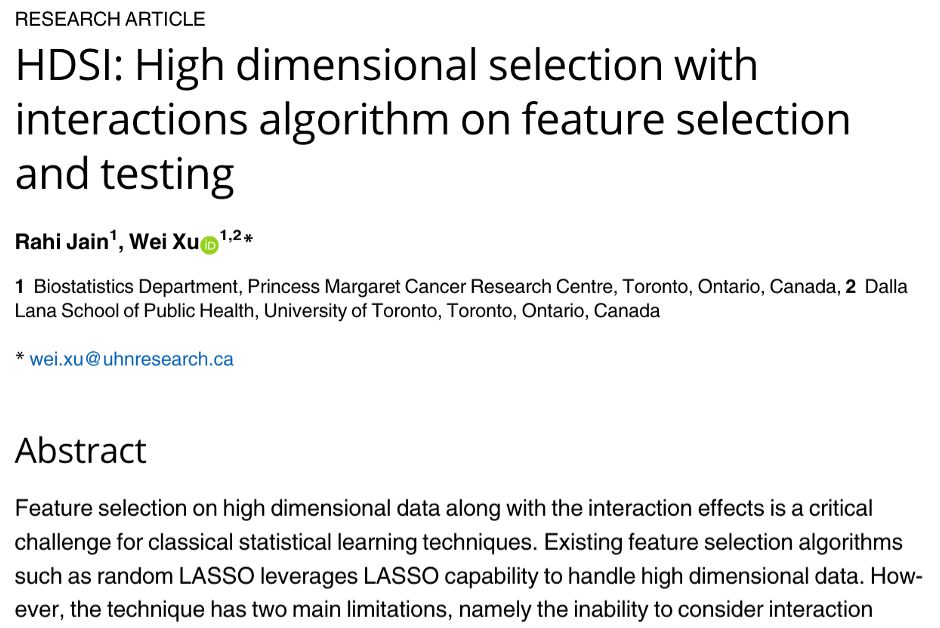
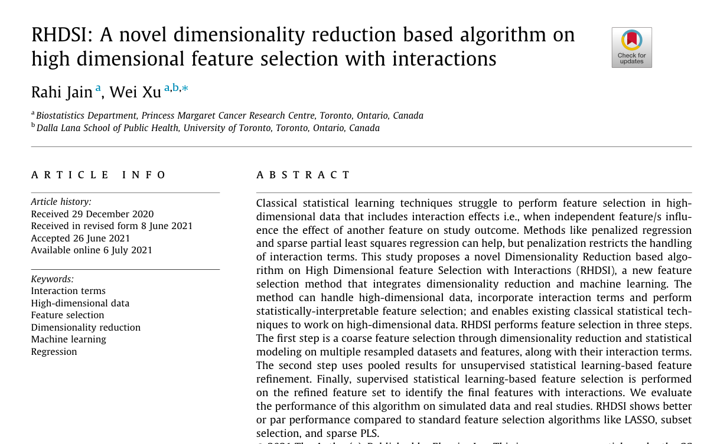
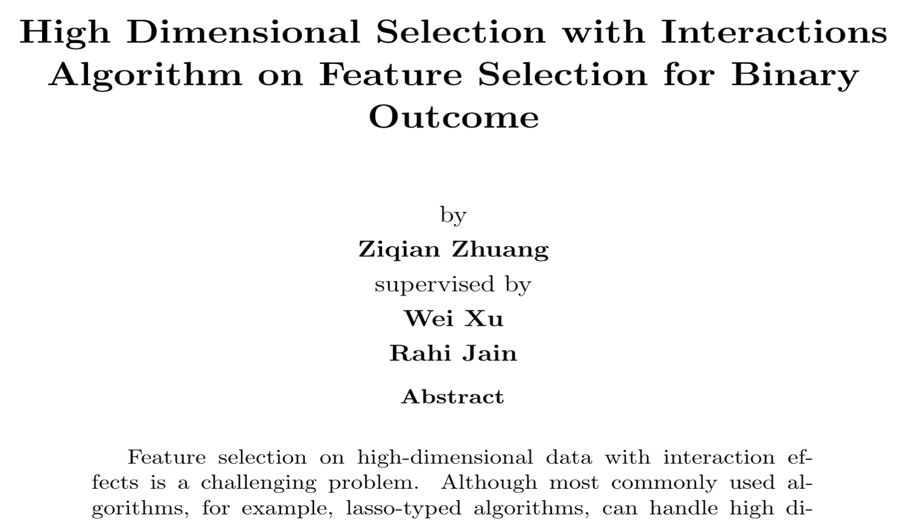
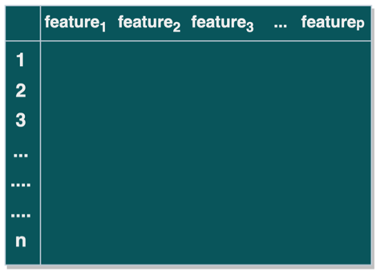
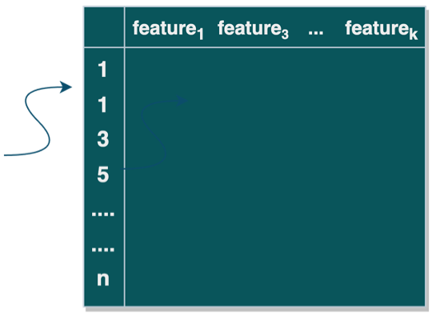
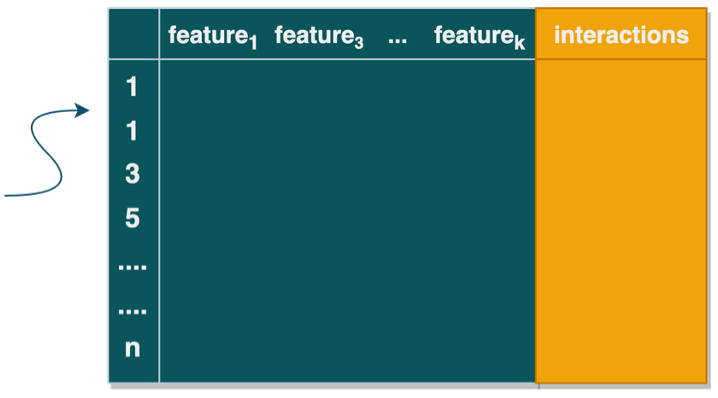
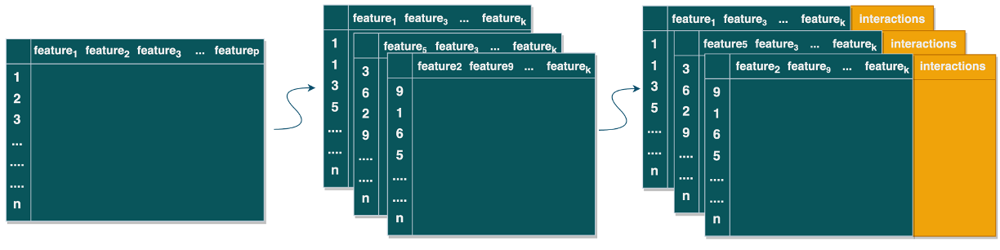
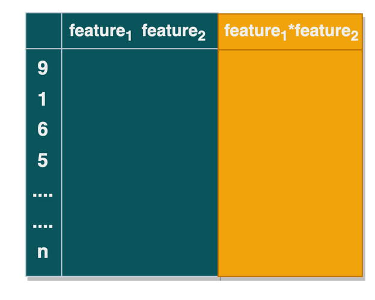
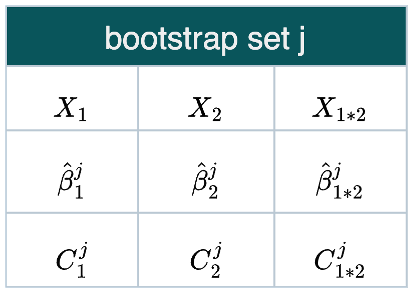
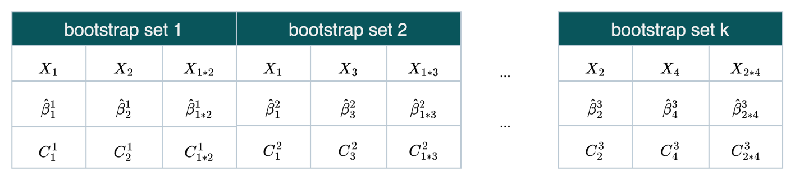

```{r setup, include=FALSE}
options(htmltools.dir.version = FALSE)
knitr::opts_chunk$set(
  fig.width=9, fig.height=3.5, fig.retina=3,
  out.width = "100%",
  cache = FALSE,
  echo = TRUE,
  message = FALSE, 
  warning = FALSE,
  hiline = TRUE
)
```

```{r xaringan-themer, include=FALSE, warning=FALSE}
library(xaringanthemer)
style_duo_accent(
  primary_color = "#1381B0",
  secondary_color = "#FF961C",
  inverse_header_color = "#FFFFFF",
  header_font_google = google_font("DM Serif Display"),
  text_font_google = google_font("DM Serif Display"),
  header_h1_font_size = "2.5rem",
  header_h2_font_size = "2rem",
  header_h3_font_size = "1.25rem",
  text_font_size = "1rem"
)
```

## Challenge of High Dimentional Data
.pull-left[
[Princess Margaret Cancer Center](https://www.uhnresearch.ca/institutes/pm)
- Cancer research: genomics, informatics, etc. 

- High dimensional data (e.g., genotyping data)

- Time-to-event data (cancer patients survival status )
]
.pull-right[

]
--
<div style="margin-left:0%; width: 100%; text-align: left;">
<span style="color:#1381B0;font-size:1.rem"> Problems?</span> 
</div>

<div style= "margin-left:2%">
<br>
<li> Time-comsuming</li>
<br>
<li> model overfitting, generalizability</li>
<br>
<li>unstable estimates</li>
<br>

</div>
--
<div style="float: left; width: 100%; text-align: left;">
<span style="margin-left: 9%;color:#1381B0;font-size:1.5rem"> It is necessary to conduct feature selection before modeling !!!</span> 

</div>


---
## Feature Selection

### What is feature selection?   

--
> A process to select **a subset of features**  that are **useful** for model building

--

### Feature selection is especially useful when:
> Have data set with high dimensional feature space:  

> Number of features are relatively large compares to number of samples/"events" (e.g, genotyping data)

--

### Commonly used techniques:
> - expert-based;   

>- statistics-based(for example, lasso,ridge)

---

<br>

<span style="color:black;font-weight:90;font-size:1.5rem"> 
However, **interactive effects are usually not considered** in the existing methods
</span>

--

<span style="color:black;font-weight:90;font-size:1.25rem"> 
**HDSI/RHDSI algorithm**: High dimensional selection with interactions algorithm, which accounts for </span> 1. interaction terms; 2. statistical significance of features

<div style="float: left; width:100%;text-align: left;line-height:2;">

<div style="float: left; width: 33%; text-align: left;">
 


</div>

<div style="float: left; width: 33%; text-align: center;">
 
</div>

<div style="float: left; width: 33%; text-align: center;">
 
</div>  

</div>

<div style="margin-left:0%;; text-align: left;font-size:0.75rem">

<p> References: </P>
<p>1.	Jain R, Xu W. HDSI: High dimensional selection with interactions algorithm on feature selection and testing. PLOS ONE.</p>    


<p>2.	Jain R, Xu W. RHDSI: A novel dimensionality reduction based algorithm on high dimensional feature selection with
interactions. Inf Sci. 2021 Oct 1;574:590–605. </p>
<p>3.	Zhuang Z, Xu W, Jain R. High Dimensional Selection with Interactions Algorithm on Feature Selection for Binary Outcome.</p> 


</div>  


---
class: center, middle 

<span style="color:black;font-weight:90;font-size:1.8rem"> 
Research question:   Is HDSI/RHDSI Robust? Can it be extend to different types of data? </span>

--

<br>

<span style="color:black;font-weight:90;font-size:1.8rem"> 
Objective: 
Develop feature selection algorithm with **interactions** for **time-to-event data**
</span>

---
# Method Pipeline

<br>
<span style="color:black;font-size:2rem"> 
> Step 1: **Develop algorithms** for model building and hyper parameters tuning

</span>

<br>

<span style="color:black;font-size:2rem"> 
> Step 2: **Conduct simulations** with high dimensional features with both marginal and interactive effects

</span>


<br>


<span style="color:black;font-size:2rem"> 
> Step 3: **Evaluate model performance** on simulated data and compare the developed method with existing methods

</span>


<br>

<span style="color:black;font-size:2rem"> 
> Step 4: Implement the algorithm into **real clinical study**

</span>


---
class: center, middle

## Framework of the Proposed Algorithm (Step 1)


---

## 1: Prepare Bootstrap Sets
<div style="float: left; width:80%;text-align: left;height:80px;line-height:2;">
 <blockquote> <span style="color:#1381B0;">1(a):</span> Prepare <span style="color:#1381B0;">one</span> 
 bootstrap set </blockquote> 
</div>

<div style="text-align: left;height:100px;">
<div style="float: left; width: 30%; text-align: center;">


<br>
<br>
Original dataset   
<br>
<br>
dimension:(n,p)
</div>
--
<div style="float: left; width: 30%; text-align: center;">


<br>
<br>
&nbsp &nbsp &nbsp &nbsp &nbsp &nbsp bootstrap set 
<br>
<br>
&nbsp &nbsp &nbsp &nbsp &nbsp &nbsp  without interactions

<br>
<br>
&nbsp &nbsp &nbsp &nbsp &nbsp &nbsp  dimension:(n,k)

</div>
--
<div style="float: left; width: 40%; text-align: center;">


<br>
<br>
&nbsp &nbsp &nbsp &nbsp &nbsp &nbsp bootstrap set 
<br>
<br>
&nbsp &nbsp &nbsp &nbsp &nbsp &nbsp  with interactions

<br>
<br>
&nbsp &nbsp &nbsp &nbsp &nbsp &nbsp  
dimension:(n,k+choose(k,2))
</div>

</div>

---
## 1: Prepare Bootstrap Sets

> <span style="color:#1381B0;">1(b):</span> Prepare **B** Bootstrap sets (i.e.,repeat 1(a) B times)

<br>



<p> &nbsp &nbsp  &nbsp &nbsp &nbsp &nbsp 

Origianl dataset 

&nbsp &nbsp  &nbsp &nbsp &nbsp &nbsp &nbsp &nbsp &nbsp &nbsp  &nbsp &nbsp &nbsp &nbsp &nbsp &nbsp &nbsp &nbsp  

<span style = "color:#1381B0">B</span> bootstrap sets without interactions 

&nbsp &nbsp  &nbsp &nbsp &nbsp &nbsp &nbsp &nbsp &nbsp &nbsp  

<span style = "color:#1381B0">B</span> bootstrap sets with interactions</p>  

---
## 2: Build Model  

> **2(a):** For the $j^{th}$ bootstrap set, apply feature selection algorithms (e.g., lasso/ridge) to fit a model:

.pull-left[
- for illustration purpose,
consider two features

- n observations]               

--

.pull-right[
$X_i: i^{th} \text{feature, } i \in \{ \text{1,2,3,...p,p+1,...}{p\choose 2}\}$

$\hat{\beta_i^j} \text{ :estimate of } X_i \text{ in the } j^{th} \text{ bootstrap set, } j \in \{ \text{1,2,3,...k}\}$

$C_i^j \text{ :C index of } X_i \text{ in the } j^{th} \text{ bootstrap set, }j \in \{ \text{1,2,3,...k}\}$
]


---

> ** 2(b):** Repeat 2(a) for all boostrap sets:



--

> **2(c):** Pool results: 

.pull-left[
$$\hat{\beta_i} = \sum_{j=1}^{k}\hat{\beta}_i^j/b_j \text{,           }
quantile( \hat{\beta}_i)$$

]

.pull-right[
- $\hat\beta_i$: pooled coefficient estimate of  $X_i$

- $b_j$: the number of bootstrap sets containing $X_i$

- $quantile( \hat{\beta}_i)$: quantile of coefficient estimate of $X_i$
]

.pull-left[
$$C_i =min(C_i^j)$$]
.pull-right[
- the $C$ index of $X_i$
]

---


.pull-left[

## 3: Select Features
> Criteria for feature selection 

- Is $X_i$ significant? (quantile includes 0)


- Does $X_i$ occur in models with high C-index

]

--

.pull-left[
## 4: Tune hyperparameters
>  Repeat 1-3 with different: 

  - number of bootstrap sets
  
  - number of features, etc.
  
]

--

## Next step

- Generate time-to-event data 

- Assess the algorithm in simulation study 

- Apply the algorithm into real clinical study 

---
class: middle, center

# Thank you!

