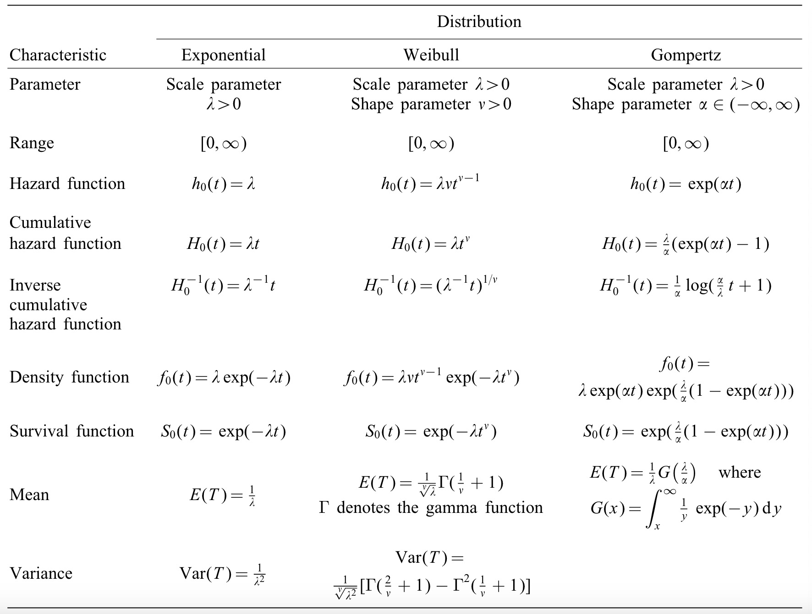
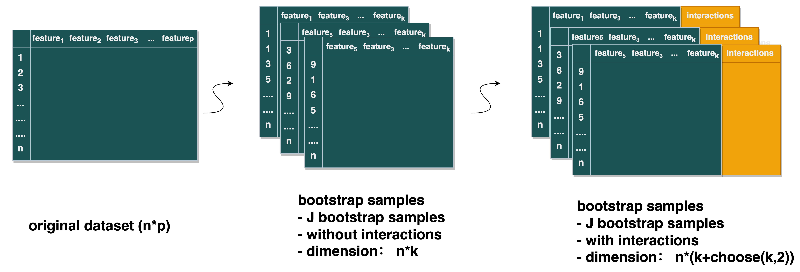

```{r setup, include=FALSE}
knitr::opts_chunk$set(echo = TRUE)
```


# Preparing simulation dataset

This study simulated time-to-event data from Cox regression with
use-specified coefficients. The harzard model is given by:
$$ h(t|X)= e^{(\alpha+\beta X)}= e^{\alpha} * e^{(\beta X)} = h_0(t)*e^{\beta X}$$
where:\
- X is the covariate vector\
- $\alpha$ is the intercept\
- $\beta$ is the coefficients vector\
- h(t\|X)is the hazard function at time t given X - $h_0(t)$ is the
baseline hazard

The survival function of the cox proportional hazards model is then
given by:

$$\begin{aligned} 
S(t|X) &= e^{H(t)}  \text{       (see appendix) } \\
       &= e^{ \int_0^t h(t|X)} \\
       &= e^{ \int_0^t h_0(t)dt*e^{\beta*X}}\\
       &= e^{ H_0(t)*e^{\beta*X}}
\end{aligned}$$

Then the **distribution function** of Cox proportional hazards model is:

$$ F(t|X) = 1 - S(t|X) = 1 - e^{ H_0(t)*e^{\beta X}} $$ t\|X \~ F,U =
F(t\|X) is uniform(0,1), 1-U = 1- F(t\|X) = S(t\|X) is also
uniform(0,1), that is:

$$U = e^{ H_0(t)*e^{\beta*X}} \text{~} U(0,1)$$

Then, $$ T = H_0^{-1}[-log(U)e^{(-\beta X)}]$$

Assumptions:

\- Survival time follows exponetial/weibull/Gompertz distribution

\- Censoring time follows exponential distribution

```{r}
#' Simulate a survival data set
#'
#' @param nsample total number of observations
#' @param varnum  total number of covariates
#' @param dist distribution of baseline hazard function
#' @param lambda scale parameter of the distribution
#' @param rho shape parameter of the distribution
#' @param beta pre-specified effect size of covariates
#' @param crate rate parameter of the exponential distribution
#' @param cor logical; whether consider the correlation between covariates
#' @param seed
#'
#' @return a dataframe; time, status, covariates
#' @export
#' @examples
#'library(survival)
#'dat <- sim_survdat_f(nsample =1000, varnum = 25,dist='g',lambda=0.01, rho=1, beta=c(2.3,0.3,0.4), crate=0.001,cor=TRUE,seed=20231106)
#'fit <- survival::coxph(Surv(time, status) ~ X1+X3+X1*X3, data=dat)

sim_survdat_f <- function(nsample = 100,
                          varnum =25,
                          dist = 'w',
                          lambda = 0.01,
                          rho = 1,
                          beta=NA,
                          crate = 0.001,
                          cor=TRUE,
                          seed = 20231106,
                          ...)
{
  library(pacman)
  pacman::p_load(tidyverse)

  Sigma=matrix(rep(0,varnum), nrow=varnum, ncol=varnum, byrow=F)

  for(i in 1:varnum){Sigma[i,i]=10}
  # Correlation Settings
  if(cor){
    Sigma[1,2]=3;Sigma[1,3]=3;Sigma[1,4]=6;Sigma[1,5]=6
    Sigma[2,1]=3;Sigma[3,1]=3;Sigma[4,1]=6;Sigma[5,1]=6
    Sigma[2,3]=3;Sigma[2,4]=2;Sigma[2,5]=1
    Sigma[3,2]=3;Sigma[4,2]=2;Sigma[5,2]=1
    Sigma[3,4]=2;Sigma[3,5]=1
    Sigma[4,3]=2;Sigma[5,3]=1
    Sigma[4,5]=1
    Sigma[5,4]=1
  }

  set.seed(seed)
  covar_df <-  data.frame(MASS::mvrnorm(n = nsample, rep(0, varnum), Sigma/10))

  beta_df <- matrix(rep(beta,each = nsample),ncol = length(beta)) %>% data.frame()

  modelvar_df <- covar_df %>% select(X1,X2,X3,X4,X5) %>% mutate(X1_X2 = X1*X2,X3_X4=X3*X4)
  Z <- apply((beta_df*modelvar_df), 1,sum) %>% unlist()## element-wise product of two data frames

  # X1 <- covar_df$X1
  # X3 <- covar_df$X3
  # Z = beta[1]*X1+beta[2]*X3+beta[3]*X1*X3

  U <- runif(n=nsample)

  if(dist == 'e'){
    time <- (- log(U) / (lambda * exp(Z)))
  }

  if(dist == 'w'){
    time <- (- log(U) / (lambda * exp(Z)))^(1 / rho)
  }

  if(dist =='g'){
    nd_term = ( (rho * log(U)) / (lambda * exp(Z)))
    time <-(1/rho) * log(1- nd_term)
  }
  # censoring times
  C <- rexp(n=nsample, rate=crate)

  # follow-up times and event indicators
  status <- as.numeric(time <= C)
  time <- pmin(time, C) ## over-write time variable, compare between time and censor time


  # data set
  data.frame(time=time,
             status=status,
             covar_df)
}


#
# set.seed(1234)
# betaHat <- rep(NA, 1e3)
# for(k in 1:1e3)
# {
#   dat <- sim_survdat_f(varnum = 25,nsample =1000, lambda=0.01, rho=1, beta=c(2.3,0.3,0.4), crate=0.001,cor=TRUE,seed=20231106)
#   fit <- coxph(Surv(time, status) ~ X1+X3+X1*X3, data=dat)
#   betaHat[k] <- fit$coef[[2]]
# }
# mean(betaHat)
```
# Bootstrap sampling



```{r}

#' Generating bootstrap sample datasets
#'
#' @param df working dataset,simulated or real data collected
#' @param nboot number of bootstrap datasets
#' @param boot_ft number of features in each bootstrap dataset
#' @param seed random seed
#'
#' @return a list, size = nboot, each element is a dataframe
#' @export
#'
#' @examples
#'library(survival)
#'dat <- sim_survdat_f(nsample =1000, varnum = 25,dist='g',lambda=0.01, rho=1, beta=c(2.3,0.3,0.4), crate=0.001,cor=TRUE,seed=20231106)
#'fit <- survival::coxph(Surv(time, status) ~ X1+X3+X1*X3, data=dat)
#' boot_lst <- boot_f(df = ,nboot = 100,boot_ft = 5,seed = 20231106)

boot_f <- function(df = NA,
                   nboot = 100,
                   boot_ft = 5,
                   seed = 20231106) {
  ## get the feature names in df total features
  tot_ft <- df %>% select(matches("^X\\d+$")) %>%
    # starts_with("X") # ^ start sign;
    # $ end of a string, d+ one or more digital
    ## This may be problematic if df is not generated from sim_surv_f
    colnames()

  set.seed(seed)

  boot_lst <- lapply(1:nboot, function(x) {
    ### sample boot_ft from tot_ft
    boot_feature <- sample(tot_ft, boot_ft, replace = FALSE) %>%
      naturalsort::naturalsort()

    ### sample nrow(df) people from df with replacement;

    boot_sample <- df %>%
      #### sample status = 1
      filter(status == 1) %>%
      sample_n(size = nrow(.), replace = TRUE) %>%
      bind_rows(df %>% filter(status == 0) %>%
        #### sample status = 0
        sample_n(size = nrow(.), replace = TRUE)) %>%
      select(time, status, all_of(boot_feature))
  })

  return(boot_lst)
}
```
# Modelling

Applied Cox regression with penalty (Lasso or Ridge)to fit the data.

```{r message=FALSE, warning=FALSE}
library(survival)
source("R/01_simulate_survival_data.R")
source("R/02_bootstrap_datasets.R")
dat <- sim_survdat_f(nsample = 1000, varnum = 25, dist = "g", lambda = 0.01, rho = 1, beta = c(1.8,0.5,0.4,-0.4,0.45,0.6,-0.6), crate = 0.001, cor = TRUE, seed = 20231106)

DT::datatable(dat, filter='top', editable = 'cell',extensions = 'Buttons',
                    options = list(dom = 'Blfrtip',
                                   scrollX = TRUE,
                                   scrollY = TRUE,
                                   buttons = c('copy', 'csv', 'excel', 'pdf', 'print'),
                                   lengthMenu = list(c(5,25,50,100,-1),
                                                     c(5,25,50,100,"All")),
                                   columnDefs = list(list(className = 'dt-center', targets = "_all"))
                                   ))

fit <- survival::coxph(Surv(time, status) ~ X1 + X2 + X3 + X4+ X5+X1*X2+X3*X4, data = dat)

plot(survfit(fit), xlab = 'Time (years)', ylab = 'Survival Probabilities')

fit

boot_lst <- boot_f(
  df = dat,
  nboot = 100,
  boot_ft = 5,
  seed = 20231106
)
#boot_df <- boot_lst[[1]]

pacman::p_load(glmnet)

HDSI_model_f <- function(boot_df = NA,
                         method = "lasso") {
  library(pacman)
  pacman::p_load(glmnet)

  ### x input in cv.glmnet
  y <- "survival::Surv(time,status)"
  ## f=stats::as.formula(paste(y," ~ .*.*."))
  f <- stats::as.formula(paste(y, " ~ .*.")) ## pair-wise interaction
  X <- stats::model.matrix(f, boot_df)[, -1]
  ### y input in cv.glmnet
  time <- boot_df$time
  status <- boot_df$status
  Y <- Surv(boot_df$time, boot_df$status)

  if (method == "lasso") {
    cv_fit <- glmnet::cv.glmnet(
      x = X, y = Y, alpha = 1,
      standardize = F, family = "cox", nfolds = 5
    )
    lambda.1se <- cv_fit$lambda.1se
    lambda.min <- cv_fit$lambda.min

    model_fit <- glmnet::glmnet(x = X, y = Y, lambda = lambda.1se, alpha = 0, standardize = F, family = "cox")
    model_coef <- as.matrix(coef(model_fit, s = lambda.1se)) %>%
      data.frame() %>%
      mutate(varname = rownames(.))

    pred <- predict(model_fit, s = lambda.1se, newx = X, type = "link")

    model_cindex <- apply(pred, 2, Cindex, y = Y)

    model_out <- model_coef %>% mutate(model_cindex = model_cindex)

    # y1 = cbind(time = time, status = status)
    #
    # apply(risk_scores, 2, glmnet::Cindex, y=y1)
  }
  if (method == "ridge") {
    cv_fit <- glmnet::cv.glmnet(
      x = X, y = Y, alpha = 0,
      standardize = F, family = "cox", nfolds = 5
    )

    lambda.1se <- cv_fit$lambda.1se
    lambda.min <- cv_fit$lambda.min

    model_fit <- glmnet::glmnet(x = X, y = Y, lambda = lambda.1se, alpha = 1, standardize = F, family = "cox")

    model_coef <- as.matrix(coef(model_fit, s = lambda.1se)) %>%
      data.frame() %>%
      mutate(varname = rownames(.))

    pred <- predict(model_fit, s = lambda.1se, newx = X, type = "link")

    model_cindex <- apply(pred, 2, Cindex, y = Y)

    model_out <- model_coef %>% mutate(model_cindex = model_cindex)
  }

  return(model_out)
}


m <- c("lasso", "ridge")

model_out_all <- lapply(1:length(m), function(x) {
  lapply(1:length(boot_lst), function(y) {
    HDSI_model_f(boot_df = boot_lst[[y]], method = m[[x]])
  })
})


tmp <- lapply(1:length(m), function(x) {
  ## bind B boot sample results into a dataframe
  perf_tmp <- model_out_all[[x]] %>% bind_rows()
  fe_star <- perf_tmp %>% group_by(model_cindex) %>% summarise(n=n())
  ### compute min_cindex
  min_cindex <- perf_tmp %>%
    group_by(varname) %>%
    summarise(min_cindex = min(model_cindex)) %>%
    mutate(
      miu_min_cindex = mean(min_cindex),
     # sigma_min_cindex = sqrt(mean((min_cindex - miu_min_cindex)^2) / (fe_star$n %>% unique() - 1)),
      sd_min_cindex = sd(min_cindex),
      Rf = 2, ## hyperparameter
      include_yn = min_cindex > (miu_min_cindex + Rf * sd_min_cindex)
    )

  ### compute coef estimate and CI
  beta_quantile <- perf_tmp %>%
    group_by(varname) %>%
    mutate(quantile = 0.05) %>% ## quantile is a hyperparameter
    summarise(
      qtl = 0.05,
      beta_hat = mean(X1),
      qtl_lower = quantile(X1, probs = qtl/2),
      qtl_upper = quantile(X1, probs = 1 - (qtl /2) ),
      include0_yn = !(((qtl_lower <= 0) & (0 <= qtl_upper)) | ((qtl_upper <= 0) & (0 <= qtl_lower)))
    )

  ### join beta and cindex in a dataframe; filter selected features
  perf <- full_join(beta_quantile, min_cindex, by = "varname") %>%
    filter(include0_yn == TRUE & include_yn == TRUE)

  ### adding back main effect if only interaction terms are selected
  included_inter <- perf$varname[str_detect(perf$varname, ":")] ## detect interaction terms

  ## detect main effect terms from interaction
  included_inter1 <- stringr::str_split(included_inter, ":") %>% unlist()

  ## final selected features
  included_fe <- c(perf$varname, included_inter1) %>% unique()

  res <- list(perf,included_fe)

  res
})


tmp11 <- tmp[[1]][[1]] %>% data.frame()
tmp21 <- tmp[[2]][[1]] %>% data.frame()


DT::datatable(tmp11, filter='top', editable = 'cell',extensions = 'Buttons',
                    options = list(dom = 'Blfrtip',
                                   scrollX = TRUE,
                                   scrollY = TRUE,
                                   buttons = c('copy', 'csv', 'excel', 'pdf', 'print'),
                                   lengthMenu = list(c(5,25,50,100,-1),
                                                     c(5,25,50,100,"All")),
                                   columnDefs = list(list(className = 'dt-center', targets = "_all"))
                                   ))

DT::datatable(tmp21, filter='top', editable = 'cell',extensions = 'Buttons',
                    options = list(dom = 'Blfrtip',
                                   scrollX = TRUE,
                                   scrollY = TRUE,
                                   buttons = c('copy', 'csv', 'excel', 'pdf', 'print'),
                                   lengthMenu = list(c(5,25,50,100,-1),
                                                     c(5,25,50,100,"All")),
                                   columnDefs = list(list(className = 'dt-center', targets = "_all"))
                                   ))


# var_freq <- stringr::str_split(min_cindex$varname,":") %>% unlist() %>% table() %>% data.frame()

```


# Survival fundation

-   Survival function: the probability of survival times T larger than t

$$S(t) = P(T>=t) = 1-P(T<t) = 1-F(t)$$

-   Hazard function : the probability of 「failure」at time t

$\begin{aligned} h(t) &= lim_{\delta_t\rightarrow0}\frac{P(t< T <= t+\delta_t|T>t)}{\delta_t} \\  &= lim_{\delta_t\rightarrow0}\frac{P(t< T <= t+\delta_t,T>t)}{\delta_t * P(T>t)} \text{        [write out the conditional probability ]}\\  &= lim_{\delta_t\rightarrow0}\frac{P(t< T <= t+\delta_t)}{\delta_t * P(T>t)} \text{            [P(t<T<=t+ {\delta_t}) is a subset of P(T>t) ]}\\  &= lim_{\delta_t\rightarrow0}\frac{F(t+\delta_t) -F(t)}{\delta_t * S(t)} \\  &= \frac{f(t)}{S(t)} \\ \end{aligned}$

-   relationships between h(t),S(t)and f(t)

$\begin{aligned} h(t) &= \frac{f(t)}{S(t)}\\  &= \frac{f(t)}{1-F(t)}\\  &= -\frac{d}{dt}ln(1-F(t))\\  &= -\frac{d}{dt}ln(S(t))\\ \end{aligned}$

$\begin{aligned} -\frac{d}{dt}ln(S(t)) &= h(t)\\  d (ln(S(t))) &= -h(t)dt\\  ln(S(t)) &= -\int_0^t h(t)dt\\  S(t) &= e^{-H(t)}\\ \end{aligned}$

